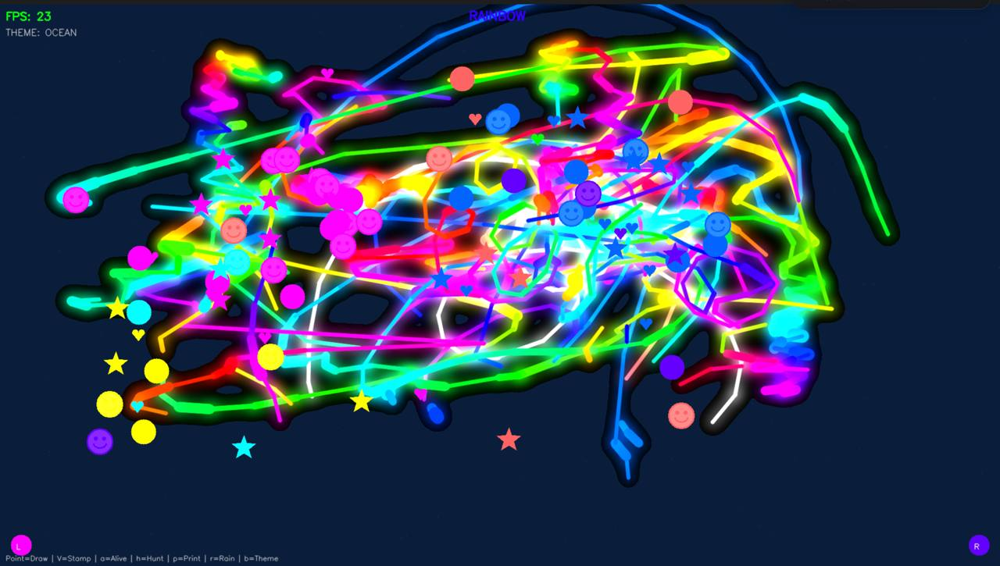

# Air Canvas 🎨

**Low-stimulus digital toy for kids — paint in the air with your hands.**

No scores. No feeds. No rewards. No dopamine loops. Just pure creativity, drawn in the air.

<p align="center">
  
</p>

<p align="center">
  
</p>

Air Canvas turns your webcam into a finger-painting canvas. **You see yourself on screen** — point your finger to draw colorful lines on top of your own image. Pick colors from the on-screen palette, grab stickers from the stamp shelf, and watch your art come alive.

Two hands, eight colors, infinite imagination. Built for kids who deserve to create without consuming.

## Why Air Canvas?

### 🧠 Cognitive Development
- **Hand-eye coordination** — kids learn to control precise finger movements while watching the screen respond in real time
- **Spatial awareness** — understanding how their hand position maps to the canvas builds spatial reasoning
- **Cause and effect** — every gesture has an immediate, visible result

### 🎨 Creative Expression
- **No rules, no templates** — just a blank canvas and colors
- **Two-hand painting** — left hand and right hand have different color palettes, encouraging bilateral coordination
- **Pressure simulation** — move slowly for thick lines, fast for thin — teaches control and intentionality

### 🧘 Low-Stimulus Design
- **No scores or achievements** — removes performance anxiety
- **No social features** — no sharing, no likes, no comparison
- **No ads, no in-app purchases** — runs 100% locally, no internet needed
- **Dark canvas** — easy on the eyes, calming environment
- **No time pressure** — kids paint at their own pace

### 👨‍👩‍👧‍👦 Parent-Child Bonding
- **Two-hand support** — parent and child can paint together on the same canvas
- **Save & print** — press `s` to save their masterpiece as PNG
- **Screen time with purpose** — active creation instead of passive consumption

## Controls

Kids only need **2 gestures** — everything else is visual:

| Gesture | Action |
|---------|--------|
| 👆 Point | Draw / select from palette or shelf |
| ✊ Fist | Stop drawing / deselect stamp |
| 🖐️ Palm (hold 1.5s) | Clear canvas (visual countdown) |

**On-screen controls (no gestures needed):**
| Element | How |
|---------|-----|
| 🎨 Color palette (left/right edges) | Point at a color, hold 0.3s to select |
| ⭐ Stamp shelf (top) | Point at a stamp, then point on canvas to place |

**Keyboard shortcuts:**
| Key | Action |
|-----|--------|
| **r** | Toggle rainbow mode |
| **s** / **p** | Save art to `~/Desktop/air-canvas-art/` |
| **c** | Clear canvas |
| **b** | Cycle background theme |
| **q** | Quit |

## Features

- **AR camera background** — see yourself behind your art (default), or switch to themed backgrounds
- **Visual color palette** — always-visible palettes on screen edges, point to select (no hidden gestures)
- **Stamp shelf** — pick stickers from the top bar, preview follows your finger, tap to place
- **Two-hand drawing** — left hand has 4 colors, right hand has 4 colors (8 total)
- **Rainbow mode** — press `r` to shift brush colors through the full spectrum
- **Save with feedback** — saves to `~/Desktop/air-canvas-art/` with visual flash, path overlay, and sound
- **Open palm clear** — hold palm still for 1.5s with visual countdown (accidental-clear-proof)
- **Sparkle particles** — light particle trail follows the fingertip
- **Fun sounds** — playful tones react to drawing, color changes, clears, and stamps
- **Pressure simulation** — brush gets thicker when slow, thinner when fast
- **Neon glow effect** — drawings look magical
- **Kid-friendly UI** — no FPS counters, no keyboard hints, no tech jargon on screen
- **Fullscreen mode** — immersive experience
- **Zero accounts, zero internet** — everything runs locally

## Requirements

- macOS (tested on Apple Silicon)
- Python 3.11+ (3.13 recommended)
- Webcam

## Quick Start

```bash
git clone https://github.com/V-Gutierrez/air-canvas.git
cd air-canvas
./run.sh
```

The script automatically:
1. Creates a Python virtual environment
2. Installs dependencies
3. Downloads the hand tracking model (~10MB)
4. Launches Air Canvas in fullscreen

## Camera Setup

By default, Air Canvas uses camera index `1` to skip iPhone Continuity Camera on MacBooks. If your webcam isn't detected, edit `config.py`:

```python
CAMERA_INDEX = 0  # Try 0 if camera doesn't open
```

## Configuration

All settings live in `config.py` — colors, brush thickness, gesture thresholds, and more. Kid-friendly defaults out of the box.

## How It Works

- **MediaPipe Hand Landmarker** — tracks 21 hand landmarks per hand at 30fps
- **OpenCV** — renders the canvas and camera feed
- **Gesture recognition** — simple heuristics (finger extension, pinch distance, palm detection)
- **Threaded camera** — camera reads run on a separate thread for smooth performance

## Built With

- [MediaPipe](https://developers.google.com/mediapipe) — hand tracking
- [OpenCV](https://opencv.org/) — rendering
- [NumPy](https://numpy.org/) — math

## License

MIT — do whatever you want with it. Make your kids happy. ✌️
